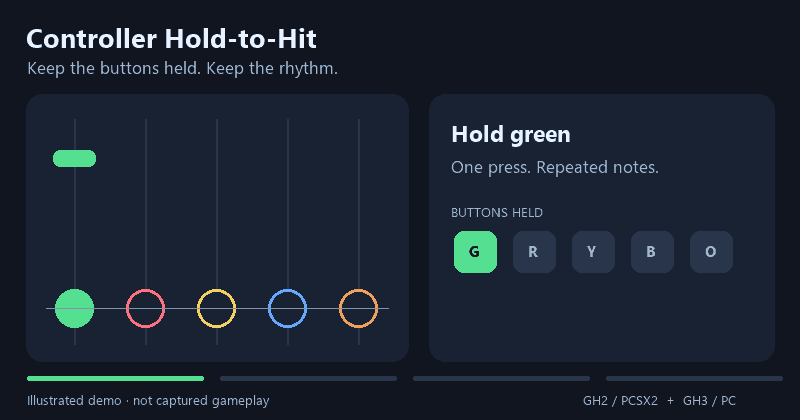

**now you can play knights of cydonia and holiday in cambodia without breaking your controller or your fingers!**

# Controller Hold-to-Hit

**Hold the buttons. Play the notes.**

Two helpers for playing Guitar Hero with a regular controller. Keep the matching fret buttons held through repeated notes, release them to stop scoring, and keep the game's judgment for ordinary presses.

*Illustrated explanation of the intended behavior—not recorded gameplay or proof of compatibility.*

## Pick your game

| Game | Download | Supported version | Setup |
| --- | --- | --- | --- |
| Guitar Hero II / PCSX2 | [GH2 Controller Hold-to-Hit](gh2-pcsx2/SLUS-21447_2A6C845B.pnach) | USA, SLUS-21447, CRC 2A6C845B | [PCSX2 guide](gh2-pcsx2/README.md) |
| Guitar Hero III / Windows PC | [GH3 Controller Hold-to-Hit](gh3-pc/GH3-HoldToHit.exe) | GH3.exe 1.0.6.57108; exact hash required | [Windows guide](gh3-pc/README.md) |

On GitHub, open the file and choose **Download raw file**. The PC helper is a standalone EXE: its patch is embedded. Neither tool contains the game, an ISO, or a PS2 BIOS.

## How it plays

- **Hold green:** matching green notes can score without repeated taps.
- **Release green:** following green notes miss.
- **Hold green on a red note:** the red note misses.
- **Hold a chord:** the held combination must match for automatic hits.
- **Make a new press:** the game's ordinary hit/miss judgment remains active.

GH3 also handles taps that overlap a note the helper just scored. One matching tap inside the native timing window can confirm that hit without an extra-press penalty. It does not add score; wrong-color presses and presses outside the window still receive normal judgment.

## Current status

These patches support the specific game builds listed above.

- **GH2:** core hold behavior was confirmed in gameplay. The patch restores native button-press judgment; broader testing is welcome.
- **GH3:** confirmed working in gameplay by the original tester on their controller setup, following the latest tapping correction. The patch also passed **107 instruction-level checks**. Other executable builds are unsupported.

Instruction tests simulate scoring callbacks and cannot establish full gameplay correctness. See [validation and testing](docs/TESTING.md) for the tested scenarios and additional checks.

## Toggle and remove

**GH2:** enable the patch in PCSX2's Cheats settings. Stop and restart the game when changing it; avoid loading an old cheat-enabled save state.

**GH3:** the helper starts **OFF**. Press **F6** while GH3 is focused to toggle. Close the helper to restore the original runtime instructions. If the helper is forcibly terminated, restarting GH3 clears the patch. Game files are not edited.

## Source and feedback

The [GH3 C# source](gh3-pc/HoldToHit.cs), assembly, embedded patch and Windows build script are included. The GH2 PNACH is plain text and contains the patch itself. [SHA-256 hashes](SHA256SUMS.txt) identify the two downloads.

When reporting a problem, include the game version, song, difficulty, controller type and a short description of the failing action. Remove personal paths before sharing a GH3 session log.

Built with reference to [ExileLord's GH3+ research](https://github.com/ExileLord/GH3-Plus) and the [PCSX2 patch format](https://pcsx2.net/docs/advanced/writing-patches/). Not affiliated with Activision, Harmonix, Neversoft or PCSX2.

Original project code is provided under the [MIT license](LICENSE). Game titles and trademarks belong to their respective owners.
